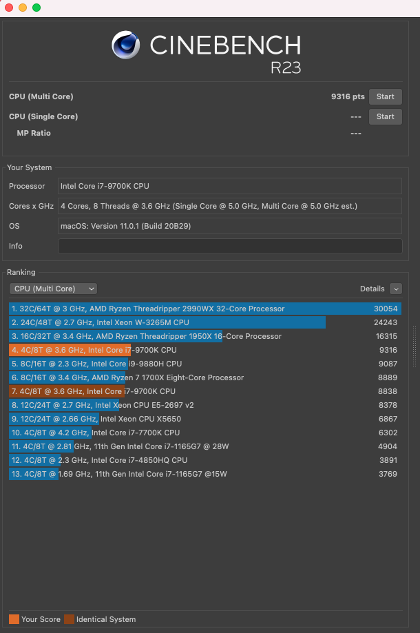

# Z390-Hackintosh-Joost
Joost's EFI for Hackintosh on Z390 Designare, i7, RX 570, 32GB RAM and Fenvi T919

# PC specifications:
- OS's installed: Big Sur dualbooted with Windows 10 Pro
- PC Case: Fractal Design Define R6 USB-C TG
- Processor: Intel Core i7 9700K, 9th Gen (Code name: Coffee Lake)
- Motherboard: Gigabyte Z390 Designare
- Sound card (onboard): ALC 1220-VB audio controller
- SSD storage: Crucial Crucial MX500, 1TB 
- Graphic card: Sapphire Nitro+ Radeon RX 570 4GD5
- Fenvi T919 for WiFi/Bluetooth, AirDrop, Apple Watch Unlock, etc.
- Power Supply: Be quiet! Dark Power PRO 11 850W
- Memory (RAM): Corsair Vengeance LPX (2x 16GB, total 32GB)
- Display: iiyama G-Master GB3466WQSU-B1 UltraWideScreen, 34 inch.
- Cooling system: Cooler Master ML360R RGB 
- Stably overclocked the CPU to 5GHz, 1.370 Volt. According: https://www.youtube.com/watch?v=6Sk4ISqmL88
  - Temperature IDLE (Still doing basic things ie. Music on, using Safari etc.): 30 degrees Celcius
  - Stress tested: 50-60 degrees Celcius:
  
 

# Notes:
- I'm not responsible for any harm done to your PC :-) Use my experiences and EFI at your own risk.
- Everything I did went according @CaseySJ his outstanding guides on:
https://www.tonymacx86.com/threads/success-gigabyte-designare-z390-thunderbolt-3-i7-9700k-amd-rx-580.267551/

# Kexts:
Make sure (!) you are using the latest kexts: 

- FakeSMC.kext
https://bitbucket.org/RehabMan/os-x-fakesmc-kozlek/downloads/
- USBInjectAll.kext
https://bitbucket.org/RehabMan/os-x-usb-inject-all/downloads/
- Lilu.kext
https://github.com/acidanthera/Lilu/releases
- WhateverGreen.kext
https://github.com/acidanthera/WhateverGreen/releases

For convenvience purposes, use either OpenCore Configurator or Hackintool to mount EFI and update the Kexts.

# BIOS Settings (from tonymacx86.com):
https://www.tonymacx86.com/threads/success-gigabyte-designare-z390-thunderbolt-3-i7-9700k-amd-rx-580.267551/

# Work Procedure:
https://www.tonymacx86.com/threads/success-gigabyte-designare-z390-thunderbolt-3-i7-9700k-amd-rx-580.267551/

# Serial number:
You need to make your own serial number, so that your iCloud etc. will work without using someone else his serial number.

# Updating Hackintosh (MacOS)
https://www.tonymacx86.com/threads/success-gigabyte-designare-z390-thunderbolt-3-i7-9700k-amd-rx-580.267551/
- Make sure you're using the latest stable release of OpenCore and that it works (you can use my efi as per below, or you can update OpenCore yourself)
- In general; watch others do first to see if they succeed
- Make sure first to install the latest Kext files
- Install latest OpenCore; but first make sure that this works according other users. Latest OpenCore build:
https://github.com/acidanthera/OpenCorePkg/releases

# EFI ZIP file:
Download here. The EFI is without my serial number:
https://mega.nz/folder/l9xGHQQC#63JkmaR5IT3ONQ4G1RmfLQ

# Resources
https://www.tonymacx86.com/threads/success-gigabyte-designare-z390-thunderbolt-3-i7-9700k-amd-rx-580.267551/
Onboard WiFi+Bluetooth Kext (BETA): https://www.tonymacx86.com/threads/success-working-intel-wifi-drivers-for-7265ac-on-catalina.292207/post-2131153
https://hackintosh.gitbook.io 
https://dortania.github.io/OpenCore-Install-Guide/extras/big-sur/#backstory
https://github.com/acidanthera/OpenCorePkg/releases
https://github.com/williambj1/OpenCore-Factory/releases
https://mackie100projects.altervista.org/download-opencore-configurator/
https://github.com/Pavo-IM/OC-Gen-X
https://github.com/Pavo-IM/ocbuilder

# BIG SUR on OpenCore
Big Sur with OpenCore is working very well. A small how-to here: 

PRECAUSION:
- I'm using OpenCore. You can download the latest build from here which you can use during the EFI creation as per below (or use mine...): https://github.com/acidanthera/OpenCorePkg/releases
- Also great info from: https://dortania.github.io/OpenCore-Install-Guide/extras/big-sur/#backstory

- USB preparation and installation of Big Sur according this video:
https://www.youtube.com/watch?v=J22vqnS-QZ4&t=2s
- Create your EFI:
https://www.youtube.com/watch?v=XyDJMNMFi6I&t=58s
- When the EFI is done, add your SSDT's and DTSD's to the EFI partition using OpenCoreConfigurator to mount the EFI
- After that, create your own Serial Number using OpenCoreConfigurator

# Latest Changes in uploaded Big Sur EFI (without a Serial Number):
(Item 0 is the oldest)

0. Installed my system succesfully using OpenCore v0.6.0
1. Tweaked it
2. Updated to Beta 3
2b. 30-7-2020 15h42 OC060 BigSurB3 NoSN.zip
3. Updated OpenCore from scratch to OpenCore v0.6.0 commitment 0e81540 via: https://github.com/williambj1/OpenCore-Factory/releases
3a. 2-8-2020 11h09 OC060 new BigSurB3 NoSN.zip
4. Updated to Beta 4
5. Updated to Public Beta (which I guess is the same as b4). 
6. 13-Oct-2020: Updated to latest Public Beta (20A5384c) and latest final OpenCore Build (v0.6.2). This is now my main system due to its stability :-)
7. 2-Nov-2020: Updated to latest Public Beta (20B5012d), 11.0.1. and OpenCore to v0.6.3.
8. 19-Dec-2020: Updated OpenCore to v0.6.4.
9. 25-Dec-2020: Update to MacOS 11.1 (20C69)
10. 12-Jan-2021: Updated OpenCore to v0.6.5.
11. 4-Feb-2021: Updated to MacOS 11.2 (20D64), using OpenCore v0.6.5.
12. 5-Feb-2021: Updated OpenCore to v0.6.6.
13. 11-Feb-2021: Updated to MacOS 11.2.1 (20D74), using OpenCore v0.6.6.
14. 22-Feb-2021: Small tweaks in EFI. Added Background.ICNS in Resources/Images folder (you can delete this if required). Also, OpenShell has been hidden now.

Download my latest Big Sur EFI here:
https://mega.nz/folder/l9xGHQQC#63JkmaR5IT3ONQ4G1RmfLQ

The following is working on macOS Big Sur so far:
CPU, RAM, Fans, Cooling etc. ✔
Audio ✔
Ethernet ✔
Graphics ✔
HDMI ✔
Sleep/wake Function ✔
Power Management ✔
App Store ✔
iMessage ✔
iCloud ✔
FaceTime ✔
USB with 2.0, 3.0, 3.1 and USB Type-C Ports ✔
Bootloader ✔
HDMI Audio ✔
Volume Hotkeys ✔
WiFi (Fenvi) ✔
Bluetooth (Fenvi) ✔
AirDrop (Fenvi) ✔
HandOff ✔ 
Side Car ✔ As you can see here using my regular display and iPad Pro:

# Update your OpenCore EFI (procedure)
https://github.com/joostiphone/Update-OpenCore-to-latest-version

# Optional: Overclocking Z390 Designare, i7-9700K to 5Ghz 
Some basic settings, but you can still look at the attached BIOS screenshots for further details:
- CPU Base Clock: 100Mhz
- Extreme Memory Profile (XMP): Profile 1
- CPU Vcore: 1.370V (instead of standard 1.200V). This is pretty high and cause degration of your CPU, just be aware...
- Active Turbo Ratios: Enabled, and set every core on 50 (50 times 100Mhz CPU Base Clock = 5000Mhz).
- C-States Control: Enable (disable all options there)

BIOS Overclock Settings (BIOS Screenshots)
https://mega.nz/file/NxxG2AbI#AvhLcGAFm98mz7CnLYa2zVFylmE6mv70xCRrGh2bJQ4
