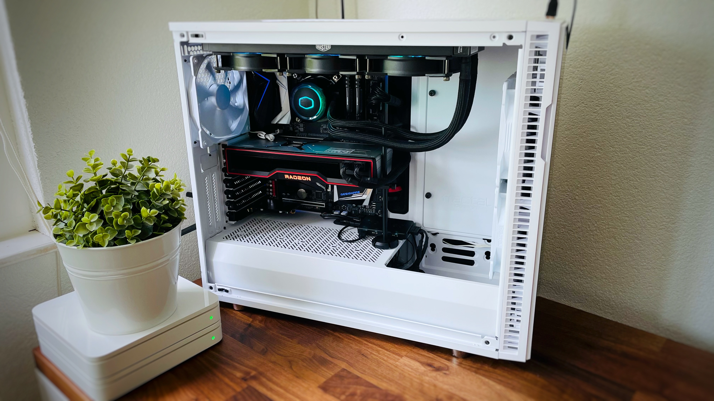
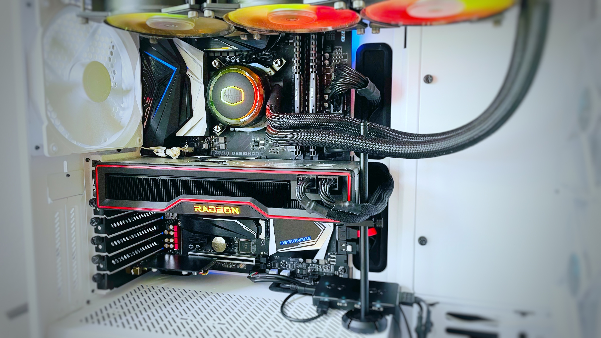
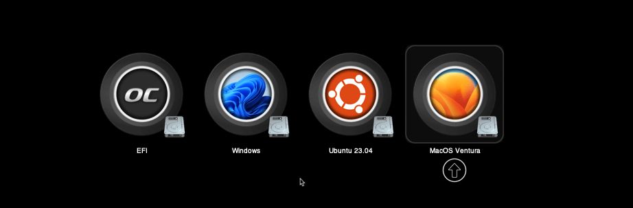
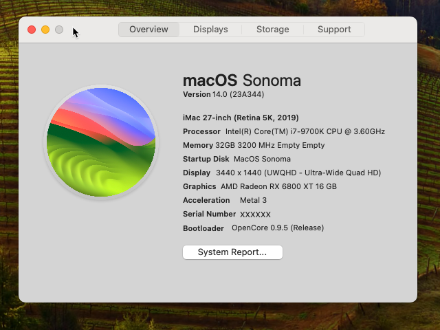
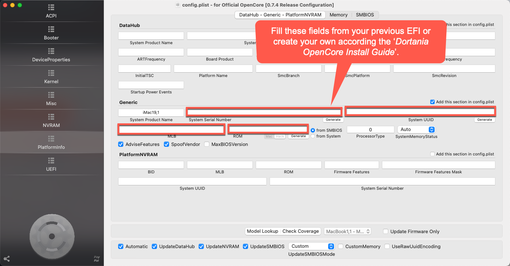

# Z390-Hackintosh-Joost
This is my Hackintosh build using a Z390 Designare, i7, RX 6800 XT, 32GB RAM and Fenvi T919.

# PC specifications:
- OS's installed: MacOS Ventura, MacOS Sonoma (beta), Windows 11 Pro and Ubuntu
- PC Case: Fractal Design Define R6 USB-C TG
- Processor: Intel Core i7 9700K, 9th Gen (Code name: Coffee Lake)
- Motherboard: Gigabyte Z390 Designare
- Sound card (onboard): ALC 1220-VB audio controller
- SSD storage: WD BLACK SN850X NVMe SSD, Crucial Crucial MX500, 1TB 
- Graphic card: AMD RX 6800 XT 16GB (previously the AMD Sapphire Nitro+ Radeon RX 570 4GD5)
- Fenvi T919 for WiFi/Bluetooth, AirDrop, Apple Watch Unlock, etc.
- Power Supply: Be quiet! Dark Power 12 1000W
- Memory (RAM): Corsair Vengeance LPX (2x 16GB, total 32GB)
- Display: iiyama G-Master GB3466WQSU-B1 UltraWideScreen, 34 inch.
- Cooling system: Cooler Master ML360R RGB 

  
 

# Notes:
- I'm not responsible for any harm done to your PC :-) Use my experiences and EFI at your own risk.
- Everything I did went according @CaseySJ his outstanding guides on:
https://www.tonymacx86.com/threads/success-gigabyte-designare-z390-thunderbolt-3-i7-9700k-amd-rx-580.267551/

# Create your USB stick with your pre-made EFI:
Please see this page:
https://github.com/joostiphone/MacOS-USB-Installer

 

# BIOS Settings (from tonymacx86.com):
https://www.tonymacx86.com/threads/success-gigabyte-designare-z390-thunderbolt-3-i7-9700k-amd-rx-580.267551/
PS: make sure you AVOID BIOS version F9j. A modified F9i version (with the security fixes from Fgj) can be found here:
https://www.tonymacx86.com/threads/success-gigabyte-designare-z390-thunderbolt-3-i7-9700k-amd-rx-580.267551/page-3038#post-2239464

#  Ventura and Sonoma on OpenCore
Ventura with OpenCore is working very well. Sonoma is in beta but works fine so far. Latest OpenCore EFI files support both Ventura and Sonoma; only difference is OC version and the use of AirPort Itlwm for Intel WiFi.

PRECAUSION:
- I'm using OpenCore. You can download the latest build from here which you can use during the EFI creation as per below (or use mine...):
-  https://github.com/acidanthera/OpenCorePkg/releases
- Also great info from: https://dortania.github.io/OpenCore-Install-Guide/extras/big-sur/#backstory

- USB preparation and installation of MacOS according this video:
https://www.youtube.com/watch?v=x6fZcFIT82c
- Create your EFI:
https://www.youtube.com/watch?v=XyDJMNMFi6I&t=58s
- When the EFI is done, add your SSDT's and DTSD's to the EFI partition using OpenCoreConfigurator to mount the EFI
- After that, create your own Serial Number using OpenCoreConfigurator

# Serial number:
You need to make your own serial number, so that your iCloud etc. will work without using someone else his serial number. In OC GEN-X or in OpenCore Configurator you can generate a new one if you don't have one yet, or if you need a new one.

# Updating Hackintosh (MacOS)
https://www.tonymacx86.com/threads/success-gigabyte-designare-z390-thunderbolt-3-i7-9700k-amd-rx-580.267551/
- Make sure you're using the latest stable release of OpenCore and that it works (you can use my efi as per below, or you can update OpenCore yourself)
- In general; watch others do first to see if they succeed
- Make sure first to install the latest Kext files
- Install latest OpenCore; but first make sure that this works according other users. Latest OpenCore build:
https://github.com/acidanthera/OpenCorePkg/releases

# Kexts:
Make sure (!) you are using the latest kexts: 

- AppleALC.kext
https://github.com/acidanthera/applealc/releases
- IntelMausi.kext
https://github.com/acidanthera/IntelMausi/releases
- SMCProcessor.kext
It's part of the VirtualSMC zip as per below kext
- USBInjectAll.kext
https://bitbucket.org/RehabMan/os-x-usb-inject-all/downloads/
- Lilu.kext
https://github.com/acidanthera/Lilu/releases
- WhateverGreen.kext
https://github.com/acidanthera/WhateverGreen/releases
- VirtualSMC.kext
https://github.com/acidanthera/VirtualSMC/releases

For convenvience purposes, use either OpenCore Configurator or Hackintool to mount EFI and update the Kexts. I always provide the latest Kexts in my EFI as per below.

# Update your OpenCore EFI (small how-to)

 # Option 1: Update using HackinDROM 
 Download the app here:
 https://hackindrom.zapto.org 
 
 and watch a how-to here:
 https://www.youtube.com/watch?v=xRuerrG-lAU&t=50s

 # Option 2: Manually
 https://github.com/joostiphone/Update-OpenCore-to-latest-version

# Latest EFI Changes (without a Serial Number):

(Item 0 is the oldest):
0. Installed my system successfully using OpenCore v0.6.0 and Big Sur
1. Tweaked it
2. Updated to Beta 3
2b. 30-7-2020 15h42 OC060 BigSurB3 NoSN.zip
3. Updated OpenCore from scratch to OpenCore v0.6.0 commitment 0e81540 via: https://github.com/williambj1/OpenCore-Factory/releases
3a. 2-8-2020 11h09 OC060 new BigSurB3 NoSN.zip
4. Updated to Beta 4
5. Updated to Public Beta (which I guess is the same as b4). 
6. 13-Oct-2020: Updated to latest Public Beta (20A5384c) and latest final OpenCore Build (v0.6.2). This is now my main system due to its stability :-)
7. 2-Nov-2020: Updated to latest Public Beta (20B5012d), 11.0.1. and OpenCore to v0.6.3.
8. 19-Dec-2020: Updated OpenCore to v0.6.4.
9. 25-Dec-2020: Update to MacOS 11.1 (20C69)
10. 12-Jan-2021: Updated OpenCore to v0.6.5.
11. 4-Feb-2021: Updated to MacOS 11.2 (20D64), using OpenCore v0.6.5.
12. 5-Feb-2021: Updated OpenCore to v0.6.6.
13. 11-Feb-2021: Updated to MacOS 11.2.1 (20D74), using OpenCore v0.6.6.
14. 22-Feb-2021: Small tweaks in EFI. Added Background.ICNS in Resources/Images folder (you can delete this if required). Also, OpenShell has been hidden now.
15. 28-Feb-2021: Updated to MacOS 11.2.2 (20D80), using OpenCore v0.6.6.
16. 9-March-2021: Updated OpenCore to v0.6.7 and to MacOS MacOS 11.2.3 (20D91).
17. 6-April-2021: Updated OpenCore to v0.6.8.
18. 28-April-2021: Updated to MacOS 11.3 (20E232), using OpenCore v0.6.8.
19. 9-May-2021: Updated to MacOS 11.3.1 (20E241), using OpenCore v0.6.9.
20. I'm now using HackinDROM to update the OpenCore EFI. Find a how-to video here on how to use HackinDROM and how to update OpenCore: https://www.youtube.com/watch?v=xRuerrG-lAU
21. 12-6-2021: Updated to MacOS 11.4 (20F71), and updated to OpenCore v0.7.0.
22. 11-7-2021: Updated to MacOS Monterey 12.0 beta (21A5268h), and updated to OpenCore v0.7.1.
23. (next update will include support for Monterey Beta 8 using OpenCore v0.7.4.). 
24. 11-10-2021: Updated to MacOS Monterey Beta 10, and updated to OpenCore v0.7.4 (plus a fix for Windows black-screen). And I changed the OpenCore Boot screen visual-wise as per my likings.
25. 8-11-2021: Updated to MacOS 12.0.1 (21A559), and updated to OpenCore 0.7.5.
26. 5-12-2021: Updated OpenCore to v0.7.6.
27. 23-12-2021: Updated to Mac OS 12.1 (21C52), ready for MacOS 12.2 (21D49).
28. 8-2-2022: Updated OpenCore to v0.7.8 and to MacOS 12.2 (21D49).
29. 13-2-2022: Updated to MacOS 12.2.1 (21D62), still using OpenCore v0.7.8.
30. 19-3-2022: MacOS 12.3 is causing problems with 5000 and 6000 serie AMD Graphic Cards. Changes to DeviceProperties are required! This config has those changes included only for the AMD 6800 graphics card. Credits: https://www.tonymacx86.com/threads/asus-z690-proart-creator-wifi-thunderbolt-4-i7-12700k-amd-rx-6800-xt.318311/post-2313032 and https://www.tonymacx86.com/threads/macos-12-3-update-causes-problems-for-5700-6700-6800-6900-graphics-cards.319421/post-2312916 . First make use of these change or this config, then update to MacOS 12.3
31. 28-4-2022: Updated to OpenCore v0.8.0 and to MacOS 12.3.1 (21E258). Deactivated kext 'SmallTree-Intel-211-82576' (the file is still saved in the folder). Ethernet ports are working out of the box starting from MacOS 12.3.1, thank you Apple!
32. 7-6-2022: Updated to OpenCore v0.8.1 and MacOS 12.4. 
33. Ventura EFI: Waiting with the release till the Ventura public beta following CaseySJ's instructions (full credits again to him). 
    Edit: @CaseySJ released instructions and EFI for multiple OS's including Ventura, based on OC 0.8.3. - https://www.tonymacx86.com/threads/success-gigabyte-designare-z390-thunderbolt-3-i7-9700k-amd-rx-580.316533/post-2331676
34. 25-7-2022: Updated to OpenCore v0.8.3 and MacOS 13.0 (Ventura) Public Beta 1 - #Hackintosh #Ventura #Z390 #Designare
35. 10-9-2022: Updated to OpenCore v0.8.4 and MacOS 13.0 (Ventura) Public Beta 5 (22A5342f)
36. 8-10-2022: Updated to OpenCore v0.8.5 and MacOS 13.0 (Ventura) Public Beta 8
37. 10-9-2023: Updated to OpenCore v0.8.8 and MacOS 13.1 (Ventura) (22C65)
38. 26-1-2023: Updated to MacOS 13.2 (22D49) 
39. 14-2-2023: Updated to MacOS 13.2.1 (22D68)
40. 16-2-2023: Updated to OpenCore v0.8.9
41. 11-5-2023: Updated to OpenCore v0.9.2 and MacOS 13.3.1 (a) (22E772610a)
42. 10-7-2023: Updated to OpenCore v0.9.4 dev. This EFI includes the AirPortItlwm (D02) WiFi driver for Intel based WiFi chips. This is eventually required for WiFi on macOS Sonoma. This EFI is setup as such as a combination with Intel WiFi (AirPortItlwm) and Fenvi Bluetooth. For more information, I'm refering to this topic:
https://forum.amd-osx.com/threads/testing-intel-wifi-itlwm-driver-for-sonoma.4557/page-2
43. 6-8-2023: Updated to OpenCore v0.9.4 dev, without AirPortItlm. I will upload a separate Sonoma version later on to keep this as vanilla as possible.
44. 11-8-2023: Updated to OpenCore v0.9.4 final. Ventura will use Broadcom (Fenvi) and Sonoma will use AirPort Itlwm Preview 05 for Intel WiFi on Sonoma, specifically for Public Beta 5. 

Using the following MinKernel and MaxKernel when using OpenCore to do conditional kext configuration when booting a macOS:
	MinKernel	MaxKernel
Mojave	18.0.0	18.99.99	
Catalina	19.0.0	19.99.99
Big Sur	20.0.0	20.99.99	
Ventura	22.0.0	22.99.99
Sonoma	23.0.0	23.99.99

# macOS Sonoma (macOS 14.0)
1. Installing macOS 14.0 beta 1 via the regular Apple channels. 
2. Created a USB. Find the instructions here: https://github.com/joostiphone/MacOS-USB-Installer
3. Created a first EFI based on the Ventura EFI. For Sonoma, I'm now using the latest OpenCore V0.9.4 dev version, and the latest Kext dev versions.
4. Updated to Sonoma beta 3
5. The current EFI is using AirPortItlwm (d02). https://github.com/OpenIntelWireless/itlwm/issues/883 . This means that the Intel WiFi on the Z390 MoBo is being used, instead of the Fenvi (broadcom) WiFi, since macOS Sonoma doesn't support Broadcom chips anymore; which forces us to use the Intel WiFi and AirPortItlwm. The Bluetooth on the Fenvi is still being used.
6. Updated to Sonoma second version of beta 3
7. Updated to Sonoma Public Beta 3 with final OpenCore v0.9.4 and final kexts. This is using AirPort Itlwm Preview 05 for Intel WiFi on Sonoma, specifically for Public Beta 5.
8. Updated to Sonoma RC2 (which will most probably become the Customer version) with final OpenCore v0.9.5 and final kexts. This is using AirPort Itlwm Preview 05 for Intel WiFi on Sonoma, specifically for Public Beta 5 and later.

# Download my latest EFI here (zip file):
On the right, here on Github, or download here. It supports Ventura, Monterey and Big Sur. The EFI is without my serial number, so you need to enter your own using OpenCore Configurator in SMBIOS:

Big Sur OpenCore:
https://mega.nz/folder/l9xGHQQC#63JkmaR5IT3ONQ4G1RmfLQ

Monterey and Ventura OpenCore:
https://mega.nz/folder/k8hwSIzB#K1b4jyXhH0XtVsxhJr9mSw

Sonoma OpenCore:
https://mega.nz/folder/ZxIUGITJ#e5u_6ZfURV0NvEmtdgW_xw

# Confirmed working (Monterey and Ventura):
CPU, RAM, Fans, Cooling etc. ✔
Audio ✔
Ethernet ✔
Graphics ✔
HDMI ✔
Sleep/wake Function ✔
Power Management ✔
App Store ✔
iMessage ✔
iCloud ✔
FaceTime ✔
USB with 2.0, 3.0, 3.1 and USB Type-C Ports ✔
Bootloader ✔
HDMI Audio ✔
Volume Hotkeys ✔
WiFi (Fenvi) ✔
Bluetooth (Fenvi) ✔
AirDrop (Fenvi) ✔
HandOff ✔ 
Side Car ✔ As you can see here using my regular display and iPad Pro:

# Optional: Overclocking Z390 Designare, i7-9700K to 5Ghz (I'm not using this, but tested with it):
Some basic settings, but you can still look at the attached BIOS screenshots for further details:
- CPU Base Clock: 100Mhz
- Extreme Memory Profile (XMP): Profile 1
- CPU Vcore: 1.370V (instead of standard 1.200V). This is pretty high and cause degration of your CPU, just be aware...
- Active Turbo Ratios: Enabled, and set every core on 50 (50 times 100Mhz CPU Base Clock = 5000Mhz).
- C-States Control: Enable (disable all options there)

BIOS Overclock Settings (BIOS Screenshots)
https://mega.nz/file/NxxG2AbI#AvhLcGAFm98mz7CnLYa2zVFylmE6mv70xCRrGh2bJQ4

# Credits:
https://github.com/joostiphone/Credits/blob/main/README.md

# Resources
- https://www.tonymacx86.com/threads/success-gigabyte-designare-z390-thunderbolt-3-i7-9700k-amd-rx-580.267551/
- https://www.tonymacx86.com/threads/success-working-intel-wifi-drivers-for-7265ac-on-catalina.292207/post-2131153
- https://hackintosh.gitbook.io 
- https://dortania.github.io/OpenCore-Install-Guide/extras/big-sur/#backstory
- https://github.com/acidanthera/OpenCorePkg/releases
- https://github.com/williambj1/OpenCore-Factory/releases
- https://mackie100projects.altervista.org/download-opencore-configurator/
- https://github.com/Pavo-IM/OC-Gen-X
- https://github.com/Pavo-IM/ocbuilder
