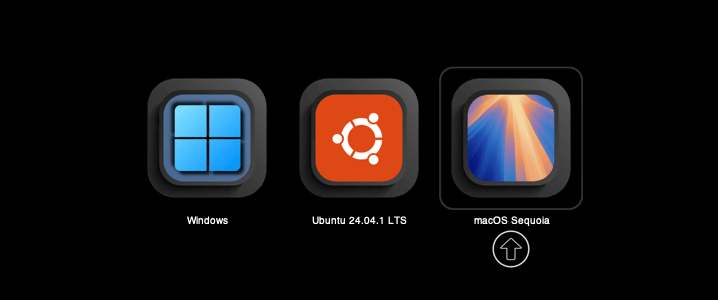
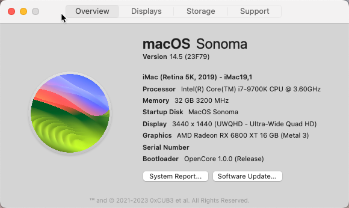

# Z390-Hackintosh-Joost
This is my Hackintosh build using a Z390 Designare, i7, RX 6800 XT, 32GB RAM and Fenvi T919.

## 📚 Table of Contents
- [🖥️ Hackintosh Multi-Boot System – Specifications](#️-hackintosh-multi-boot-system--specifications)
- [⚙️ System Configuration](#️-system-configuration)
- [💽 Operating Systems Installed](#-operating-systems-installed)
- [🧰 Bootloader](#-bootloader)
- [Create your USB stick with your pre-made EFI](#create-your-usb-stick-with-your-pre-made-efi)
- [🔧 OpenCore Configuration Overview](#-opencore-configplist-key-section-overview)
- [🖥️ PlatformInfo > Generic](#️-platforminfo--generic)
- [🧠 NVRAM > boot-args](#️-nvram--boot-args)
- [🧩 Kernel > Add (Kexts)](#-kernel--add-kexts)
- [⚙️ ACPI > Add (SSDTs)](#️-acpi--add-ssdts)
- [🧬 BIOS Configuration](#-bios-configuration-for-opencore-hackintosh-z390--gigabyte-designare-example)
- [🍇 Sonoma and Ventura on OpenCore](#sonoma-and-ventura-on-opencore)
- [🌲 Sequoia and Sonoma on OpenCore](#sequoia-and-sonoma-on-opencore)
- [🏔️ Tahoe on OpenCore](#tahoe-on-opencore)
- [⚠️ PRECAUTION:](#-precaution)
- [Update your OpenCore EFI (small how-to)](#update-your-opencore-efi-small-how-to)
- [📥 EFI Downloads](#download-my-efis-here-zip-file)
- [📝 EFI Changelogs](#efi-changelogs)
- [✅ Confirmed Functionality](#-confirmed-functionality)
- [⚡ Overclocking (Optional)](#optionally-overclocking-to-5ghz)
- [🙌 Credits and Resources](#credits-and-resources)

## 🖥️ Hackintosh Multi-Boot System – Specifications

This system runs macOS Sequoia, Windows 11 Pro, and Ubuntu in a multi-boot setup using OpenCore. Below is a detailed breakdown of the hardware configuration:

### ⚙️ System Configuration

| Component        | Specification |
|------------------|---------------|
| **CPU**          | Intel Core i7-9700K (9th Gen, Coffee Lake) |
| **Motherboard**  | Gigabyte Z390 Designare |
| **Case**         | Fractal Design Define R6 USB-C TG |
| **Cooling**      | Cooler Master ML360R RGB (AIO Liquid Cooler) |
| **Power Supply** | Be quiet! Dark Power 12 – 1000W |
| **GPU**          | AMD Radeon RX 6800 XT, 16 GB VRAM (Previously: AMD Sapphire Nitro+ RX 570 4GB) |
| **RAM**          | 32 GB Corsair Vengeance LPX DDR4 (2×16GB) |
| **Storage**      | - WD BLACK SN850X NVMe SSD - Crucial MX500 SSD – 1TB |
| **Audio**        | ALC1220-VB Onboard Audio (Realtek) |
| **Wi-Fi / BT**   | Fenvi T919 (AirDrop, Handoff, Apple Watch Unlock, Continuity) |
| **Monitor**      | iiyama G-Master GB3466WQSU-B1 34" UltraWide, DisplayPort |

### 💽 Operating Systems Installed

- **macOS Sequoia**
- **Windows 11 Pro**
- **Ubuntu (latest LTS)**

### 🧰 Bootloader

- **OpenCore** – Triple boot setup with dedicated drives for each OS. macOS is configured with native NVRAM, GPU acceleration, and Thunderbolt support.

> For detailed BIOS settings and `config.plist` configuration, see the [BIOS Setup](#-bios-configuration-for-opencore-hackintosh-z390--gigabyte-designare-example) section.

  
 

# Notes:
- I'm not responsible for any harm done to your PC :-) Use my experiences and EFI at your own risk.
- Everything I did went according @CaseySJ his outstanding guides on:
https://www.tonymacx86.com/threads/success-gigabyte-designare-z390-thunderbolt-3-i7-9700k-amd-rx-580.267551/

#  Create your USB stick with your pre-made EFI:
Please see this page:
https://github.com/joostiphone/MacOS-USB-Installer

 

# 🔧 OpenCore config.plist Key Section Overview

This section provides an explanation of the most commonly used settings in a Hackintosh `config.plist` file, useful for understanding how OpenCore enables macOS to run on non-Apple hardware.

## 🖥️ PlatformInfo > Generic

| **Key** | **Description** |
|--------|------------------|
| `SystemProductName` | Defines the Mac model to spoof (e.g., iMac20,2, MacPro7,1, etc.). This determines compatibility with macOS updates and hardware acceleration. |
| `SystemSerialNumber` | A unique serial number for the system. Should not match any real Mac to avoid iCloud/iMessage issues. |
| `MLB` (Main Logic Board) | Logic board serial number. Required for Apple ID services like iMessage and FaceTime. Must match the spoofed SMBIOS model. |
| `ROM` | Typically the MAC address of the system’s primary network adapter (Ethernet). Used as part of Apple’s service validation. |
| `SystemUUID` | A Universally Unique Identifier for the system. Used by services such as iCloud, Handoff, and Continuity. |

## 🧠 NVRAM > boot-args

The `boot-args` field passes arguments to the macOS kernel at startup. These are used for enabling specific functionality, debugging, and patching:

| **Common Boot Args** | **Description** |
|----------------------|-----------------|
| `agdpmod=pikera` | Enables AMD GPU support by patching AppleGraphicsDevicePolicy. Required for most Navi (RX 5000/6000) cards. |
| `alcid=xx` | Enables onboard audio through AppleALC, where `xx` is your layout ID (e.g., `alcid=11`). |
| `-lilubetaall` | Allows Lilu to load in macOS beta versions or on newer OS builds. |
| `-wegbeta` | Enables beta support in WhateverGreen. Useful with newer GPUs or experimental macOS versions. |
| `-v` | Verbose boot (shows text during boot instead of the Apple logo). |
| `keepsyms=1 debug=0x100` | Debug options useful during troubleshooting and kernel panics. |
| `-vsmcbeta`, `-revbeta` | Enable beta support for VirtualSMC and RestrictEvents kexts, respectively. Only needed when using beta versions of these kexts. |

## 🧩 Kernel > Add (Kexts)
These kernel extensions (kexts) are required to emulate Apple hardware functionality or enable third-party components:

| **Kext File**               | **Description**                                                         | **Required?** | **Notes** |
|----------------------------|-------------------------------------------------------------------------|---------------|-----------|
| `Lilu.kext`                | Core patching engine for other kexts like WEG and AppleALC              | ✅ Yes        | Always required for modern macOS builds |
| `WhateverGreen.kext`       | Graphics patching for AMD, Intel, and legacy NVIDIA GPUs                | ✅ Yes        | Required for RX 6800 XT (use `agdpmod=pikera` in boot-args) |
| `AppleALC.kext`            | Enables audio via layout injection (e.g., Realtek ALC1220-VB)            | ✅ Yes        | Use boot-arg `alcid=11` for Gigabyte Z390 onboard audio |
| `VirtualSMC.kext`          | Emulates Apple’s SMC for temperature, fans, power management             | ✅ Yes        | Core component – replaces FakeSMC |
| `SMCProcessor.kext`        | Adds CPU temperature sensors (used with VirtualSMC)                      | ⚠️ Optional   | Only required for monitoring tools like iStat Menus or HWMonitor |
| `SMCSuperIO.kext`          | Adds motherboard fan/voltage sensors                                     | ⚠️ Optional   | Same as above – enables full hardware monitoring |
| `IntelMausi.kext`          | Intel Ethernet driver (i219-V on Z390)                                   | ✅ Yes        | Enables native Ethernet without additional config |
| `NVMeFix.kext`             | Optimizes NVMe SSD behavior and power management                         | ✅ Yes        | Recommended for all NVMe drives (e.g., WD SN850X) |
| `RestrictEvents.kext`      | Prevents crashes and issues on unsupported CPUs in macOS 14+             | ✅ Yes        | Required for macOS Sonoma and Sequoia |
| `AirportItlwm.kext`        | Intel Wi-Fi support (for CNVi cards)                                     | ✅ Yes        | Use if you rely on built-in Intel Wi-Fi instead of Fenvi T919 |
| `BrcmPatchRAM3.kext`       | Enables Broadcom Bluetooth stack                                         | ✅ Yes        | Required for Fenvi T919 or any Broadcom BT module |
| `BrcmFirmwareData.kext`    | Loads Bluetooth firmware for Broadcom adapters                           | ✅ Yes        | Works in tandem with PatchRAM |
| `BrcmBluetoothInjector.kext` | Injects BT configuration for Broadcom modules                         | ✅ Yes        | Required for Broadcom BT on macOS ≤14 |
| `USBInjectAll.kext`        | Legacy USB injector for all ports                                        | ❌ No         | Only useful during port-mapping; not needed with `SSDT-UIAC.aml` or `USBPorts.kext` |
| `USBPorts.kext` / `USBToolBox.kext` | Custom USB mapping solution                             | ✅ Yes        | Use one or the other (not both); alternative to using `SSDT-UIAC.aml` |

## ⚙️ ACPI > Add (SSDTs)

Custom SSDTs (ACPI tables) improve hardware compatibility and allow macOS to recognize or emulate missing components:

| **SSDT Filename** | **Description** | **Required?** | **Notes** |
|------------------|------------------|----------------|-----------|
| `SSDT-PLUG.aml` | Enables native CPU power management via Apple XCPM. | ✅ Yes | Required for proper CPU frequency scaling. |
| `SSDT-EC.aml` | Emulates a missing Embedded Controller (EC). | ✅ Yes | Required for booting on most modern motherboards. |
| `SSDT-UIAC.aml` | Custom USB port mapping to stay under the 15-port macOS limit. | ✅ Yes | Should be used instead of USBInjectAll long-term. |
| `SSDT-DTPG.aml` | Enables patching ACPI methods (_STA/_INI) used by other SSDTs. | ✅ Yes | Often a dependency for UIAC or Thunderbolt SSDTs. |
| `SSDT-TB3.aml` | Enables Thunderbolt 3 hotplug and stability. | ⚠️ Optional | Required if using Thunderbolt ports. |
| `SSDT-DMAR.aml` | Patches or emulates VT-d ACPI table. | ⚠️ Optional | Only needed if VT-d is enabled. |
| `SSDT-DMAC.aml` | Adds DMA controller definition. | ⚠️ Optional | Avoids ACPI warnings; safe to include. |
| `SSDT-NVRAM.aml` | Emulates NVRAM if missing in BIOS. | ❓ Depends | Only for systems without native NVRAM support. |
| `SSDT-USBW.aml` | Enables USB wake from sleep. | ⚠️ Optional | Only needed for wake-on-keyboard/mouse. |

## 💡 Notes

- ✅ = Required for most setups  
- ⚠️ = Only needed in specific situations  
- ❓ = Depends on system firmware/hardware

For full config structure examples and verified setups, visit [Dortania's OpenCore Install Guide](https://dortania.github.io/OpenCore-Install-Guide/).

## 🧬 BIOS Configuration for OpenCore Hackintosh (Z390 / Gigabyte Designare Example)

### BIOS Settings (from tonymacx86.com):
https://www.tonymacx86.com/threads/success-gigabyte-designare-z390-thunderbolt-3-i7-9700k-amd-rx-580.267551/
PS: make sure you AVOID BIOS version F9j. A modified F9i version (with the security fixes from Fgj) can be found here:
https://www.tonymacx86.com/threads/success-gigabyte-designare-z390-thunderbolt-3-i7-9700k-amd-rx-580.267551/page-3038#post-2239464

To ensure compatibility with macOS and OpenCore, your BIOS must be configured correctly. Follow these steps before booting into the installer.

### Instructions

1. **Enter BIOS Setup**  
   Press `F2` during startup to enter BIOS and switch to **Advanced Mode**.

2. **Load Optimized Defaults**  
   Press `F7` → Confirm to load default settings.

3. **Apply the Following Settings:**

<pre><code>### Tweaker Tab
Extreme Memory Profile (X.M.P) → <strong>Profile 1</strong>

Advanced CPU Settings →  
  VT-d → <strong>Enabled</strong>  # Required for AppleVTD in macOS

### Settings Tab
Internal Graphics → <strong>Enabled</strong>  # Required for headless iGPU setups or iGPU acceleration  
Above 4G Decoding → <strong>Enabled</strong>  # Required for AMD GPUs and macOS memory mapping

### Thunderbolt(TM) Configuration
Security Level → <strong>No Security</strong>  # Allows macOS to detect Thunderbolt devices  
(If Save & Exit dialog appears, press ESC to cancel)

### Discrete Thunderbolt(TM) Configuration
Thunderbolt USB Support → <strong>Enabled</strong>  
GPIO3 Force Pwr → <strong>Enabled</strong>

### USB Configuration
XHCI Handoff → <strong>Enabled</strong>  # Required for proper USB support

### Boot Tab
Windows 8/10 Features → <strong>Other OS</strong>  
CSM Support → <strong>Disabled</strong>  
# Some GPUs may require CSM to be enabled. Use what works for your hardware.

### Save & Exit
Save Profiles → <strong>Save to Profile 1</strong>  
# This stores your BIOS settings for easy recovery.
</code></pre>

4. **For Firmware Version F9i and newer:**

<pre><code>### Boot Tab
CFG-Lock → <strong>Disabled</strong>  # Allows macOS kernel to write MSR 0xE2 (power management)
</code></pre>

### 💡 Notes
- If your system has trouble booting, try toggling `CSM Support`.
- `Above 4G Decoding` is critical for users with AMD GPUs (like RX 6800 XT).
- `VT-d` must be enabled for `AppleVTD` in macOS 12.3 and later.
- Always save BIOS settings to a profile for quick recovery in case of resets.

# Sonoma and Ventura on OpenCore
🍇 Sonoma and Ventura with OpenCore are working very well. OpenCore EFI files support both Ventura and Sonoma; only difference is OC version and the use of AirPort Itlwm for Intel WiFi.

# Sequoia and Sonoma on OpenCore
🌲 Sequoia on Opencore is working fine also with a few things to keep in mind: I'm using Heliport+Itlwm, and when installing it needs the HDMI port instead of the DisplayPort. 
So far, Sonoma works with the same EFI, so you can dualboot without any trouble. 

# Tahoe on OpenCore
🏔️ Working on it...

20-6-2025 Progress has been made:

## 🧪 Installing macOS Tahoe Developer Beta 1 on a Z390 Designare Hackintosh (i7-9700K)

🚠 **Work in Progress**
Please note: macOS 26 “Tahoe” is still in early developer beta stage. There are multiple unresolved bugs both in Apple’s system components and third-party kexts. Expect instability, incomplete hardware support, and changes with every beta. Use this only on non-critical systems and with a separate SSD.

---

### ✅ Requirements

* A working Hackintosh system (e.g. running macOS Sequoia or earlier)
* A separate SSD (do **not** install over your main macOS installation)
* OCAuxiliaryTools installed on your working system
* Two provided EFI folders:

  * `20-6-2025 EFI for Installation of Tahoe.zip`
  * `20-6-2025 EFI for Tahoe SSD After Install.zip`

---

### 🛠️ Installation Steps

#### 0. Create a bootable macOS Tahoe USB stick

Follow the instructions here:
🔗 [https://github.com/joostiphone/MacOS-USB-Installer](https://github.com/joostiphone/MacOS-USB-Installer)

---

#### 1. Extract `20-6-2025 EFI for Installation of Tahoe.zip`

This EFI is specifically prepared to boot the macOS Tahoe installer.

---

#### 2. Copy this EFI folder to your USB stick

* Mount the EFI partition of the USB using OCAuxiliaryTools (`⌘ + M` in OCAT)
* Replace any existing `EFI` folder (if there is any) with the extracted one

---

#### 3. Boot the USB and install macOS Tahoe

* Boot your Hackintosh using the USB stick (use BIOS boot menu: `F12`)
* Select “Install macOS” from OpenCore
* Be sure to install onto a **separate SSD** — this ensures your working system remains untouched

---

#### 4. If installation gets stuck (common in Dev Beta 1):

* Reboot back into your current macOS installation (e.g. Sequoia) by pressing `F12` and choosing Sequoia
* Mount the EFI partition of the SSD where you just installed Tahoe
* Use OCAuxiliaryTools to replace that EFI (if any) with the one from:
  `20-6-2025 EFI for Tahoe SSD After Install.zip`

---

#### 5. Reboot and boot from the macOS Tahoe SSD

* Use the BIOS (`F12`) to select the SSD that now holds macOS Tahoe
* Proceed with the remaining installation steps

---

#### 6. Complete the installation

macOS should now continue and finalize the setup process. Be patient — it may reboot several times.

---

#### 7. You’re in!

If all goes well, you’ll land on the macOS Tahoe desktop.

---

#### 🗭 Notes and Known Issues

* FileVault seems to turn on all of a sudden in macOS Tahoe Dev1, so make sure that you enable automatic login in macOS Settings
* Expect bugs and missing features — this is developer-only software

# ⚠️ Precaution
- I'm using OpenCore. You can download the latest build from here which you can use during the EFI creation as per below (or use mine...):
-  https://github.com/acidanthera/OpenCorePkg/releases
- Also great info from: https://dortania.github.io/OpenCore-Install-Guide/extras/big-sur/#backstory

- USB preparation and installation of MacOS according this video:
https://www.youtube.com/watch?v=x6fZcFIT82c
- Create your EFI:
https://www.youtube.com/watch?v=XyDJMNMFi6I&t=58s
- When the EFI is done, add your SSDT's and DTSD's to the EFI partition using OpenCoreConfigurator to mount the EFI
- After that, create your own Serial Number using OpenCoreConfigurator

# Serial number:
You need to make your own serial number, so that your iCloud etc. will work without using someone else his serial number. In OC GEN-X or in OpenCore Configurator you can generate a new one if you don't have one yet, or if you need a new one.

# Updating Hackintosh (MacOS)
https://www.tonymacx86.com/threads/success-gigabyte-designare-z390-thunderbolt-3-i7-9700k-amd-rx-580.267551/
- Make sure you're using the latest stable release of OpenCore and that it works (you can use my efi as per below, or you can update OpenCore yourself)
- In general; watch others do first to see if they succeed
- Make sure first to install the latest Kext files
- Install latest OpenCore; but first make sure that this works according other users. Latest OpenCore build:
https://github.com/acidanthera/OpenCorePkg/releases

# Update your OpenCore EFI (small how-to)

 # Option 1: Update using HackinDROM 
 Download the app here:
 https://hackindrom.zapto.org 
 
 and watch a how-to here:
 https://www.youtube.com/watch?v=xRuerrG-lAU&t=50s

 # Option 2: Manually
 https://github.com/joostiphone/Update-OpenCore-to-latest-version

# EFI Changelogs:

# macOS Big Sur (macOS 11), Monterey (macOS) and Ventura (macOS 13)
(Item 0 is the oldest):
0. Installed my system successfully using OpenCore v0.6.0 and Big Sur
1. Tweaked it
2. Updated to Beta 3
2b. 30-7-2020 15h42 OC060 BigSurB3 NoSN.zip
3. Updated OpenCore from scratch to OpenCore v0.6.0 commitment 0e81540 via: https://github.com/williambj1/OpenCore-Factory/releases
3a. 2-8-2020 11h09 OC060 new BigSurB3 NoSN.zip
4. Updated to Beta 4
5. Updated to Public Beta (which I guess is the same as b4). 
6. 13-Oct-2020: Updated to latest Public Beta (20A5384c) and latest final OpenCore Build (v0.6.2). This is now my main system due to its stability :-)
7. 2-Nov-2020: Updated to latest Public Beta (20B5012d), 11.0.1. and OpenCore to v0.6.3.
8. 19-Dec-2020: Updated OpenCore to v0.6.4.
9. 25-Dec-2020: Update to MacOS 11.1 (20C69)
10. 12-Jan-2021: Updated OpenCore to v0.6.5.
11. 4-Feb-2021: Updated to MacOS 11.2 (20D64), using OpenCore v0.6.5.
12. 5-Feb-2021: Updated OpenCore to v0.6.6.
13. 11-Feb-2021: Updated to MacOS 11.2.1 (20D74), using OpenCore v0.6.6.
14. 22-Feb-2021: Small tweaks in EFI. Added Background.ICNS in Resources/Images folder (you can delete this if required). Also, OpenShell has been hidden now.
15. 28-Feb-2021: Updated to MacOS 11.2.2 (20D80), using OpenCore v0.6.6.
16. 9-March-2021: Updated OpenCore to v0.6.7 and to MacOS MacOS 11.2.3 (20D91).
17. 6-April-2021: Updated OpenCore to v0.6.8.
18. 28-April-2021: Updated to MacOS 11.3 (20E232), using OpenCore v0.6.8.
19. 9-May-2021: Updated to MacOS 11.3.1 (20E241), using OpenCore v0.6.9.
20. I'm now using HackinDROM to update the OpenCore EFI. Find a how-to video here on how to use HackinDROM and how to update OpenCore: https://www.youtube.com/watch?v=xRuerrG-lAU
21. 12-6-2021: Updated to MacOS 11.4 (20F71), and updated to OpenCore v0.7.0.
22. 11-7-2021: Updated to MacOS Monterey 12.0 beta (21A5268h), and updated to OpenCore v0.7.1.
23. (next update will include support for Monterey Beta 8 using OpenCore v0.7.4.). 
24. 11-10-2021: Updated to MacOS Monterey Beta 10, and updated to OpenCore v0.7.4 (plus a fix for Windows black-screen). And I changed the OpenCore Boot screen visual-wise as per my likings.
25. 8-11-2021: Updated to MacOS 12.0.1 (21A559), and updated to OpenCore 0.7.5.
26. 5-12-2021: Updated OpenCore to v0.7.6.
27. 23-12-2021: Updated to Mac OS 12.1 (21C52), ready for MacOS 12.2 (21D49).
28. 8-2-2022: Updated OpenCore to v0.7.8 and to MacOS 12.2 (21D49).
29. 13-2-2022: Updated to MacOS 12.2.1 (21D62), still using OpenCore v0.7.8.
30. 19-3-2022: MacOS 12.3 is causing problems with 5000 and 6000 serie AMD Graphic Cards. Changes to DeviceProperties are required! This config has those changes included only for the AMD 6800 graphics card. Credits: https://www.tonymacx86.com/threads/asus-z690-proart-creator-wifi-thunderbolt-4-i7-12700k-amd-rx-6800-xt.318311/post-2313032 and https://www.tonymacx86.com/threads/macos-12-3-update-causes-problems-for-5700-6700-6800-6900-graphics-cards.319421/post-2312916 . First make use of these change or this config, then update to MacOS 12.3
31. 28-4-2022: Updated to OpenCore v0.8.0 and to MacOS 12.3.1 (21E258). Deactivated kext 'SmallTree-Intel-211-82576' (the file is still saved in the folder). Ethernet ports are working out of the box starting from MacOS 12.3.1, thank you Apple!
32. 7-6-2022: Updated to OpenCore v0.8.1 and MacOS 12.4. 
33. Ventura EFI: Waiting with the release till the Ventura public beta following CaseySJ's instructions (full credits again to him). 
    Edit: @CaseySJ released instructions and EFI for multiple OS's including Ventura, based on OC 0.8.3. - https://www.tonymacx86.com/threads/success-gigabyte-designare-z390-thunderbolt-3-i7-9700k-amd-rx-580.316533/post-2331676
34. 25-7-2022: Updated to OpenCore v0.8.3 and MacOS 13.0 (Ventura) Public Beta 1 - #Hackintosh #Ventura #Z390 #Designare
35. 10-9-2022: Updated to OpenCore v0.8.4 and MacOS 13.0 (Ventura) Public Beta 5 (22A5342f)
36. 8-10-2022: Updated to OpenCore v0.8.5 and MacOS 13.0 (Ventura) Public Beta 8
37. 10-9-2023: Updated to OpenCore v0.8.8 and MacOS 13.1 (Ventura) (22C65)
38. 26-1-2023: Updated to MacOS 13.2 (22D49) 
39. 14-2-2023: Updated to MacOS 13.2.1 (22D68)
40. 16-2-2023: Updated to OpenCore v0.8.9
41. 11-5-2023: Updated to OpenCore v0.9.2 and MacOS 13.3.1 (a) (22E772610a)
42. 10-7-2023: Updated to OpenCore v0.9.4 dev. This EFI includes the AirPortItlwm (D02) WiFi driver for Intel based WiFi chips. This is eventually required for WiFi on macOS Sonoma. This EFI is setup as such as a combination with Intel WiFi (AirPortItlwm) and Fenvi Bluetooth. For more information, I'm refering to this topic:
https://forum.amd-osx.com/threads/testing-intel-wifi-itlwm-driver-for-sonoma.4557/page-2
43. 6-8-2023: Updated to OpenCore v0.9.4 dev, without AirPortItlm. I will upload a separate Sonoma version later on to keep this as vanilla as possible.
44. 11-8-2023: Updated to OpenCore v0.9.4 final. Ventura will use Broadcom (Fenvi) and Sonoma will use AirPort Itlwm Preview 05 for Intel WiFi on Sonoma, specifically for Public Beta 5. 

Using the following MinKernel and MaxKernel when using OpenCore to do conditional kext configuration when booting a macOS:
		MinKernel	MaxKernel
Mojave		18.0.0		18.99.99	
Catalina	19.0.0		19.99.99
Big Sur		20.0.0		20.99.99	
Monterey  	21.0.0    	21.99.99
Ventura		22.0.0		22.99.99
Sonoma		23.0.0		23.99.99
Sequoia		24.0.0		24.99.99

# macOS Sonoma (macOS 14)
1. Installing macOS 14.0 beta 1 via the regular Apple channels. 
2. Created a USB. Find the instructions here: https://github.com/joostiphone/MacOS-USB-Installer
3. Created a first EFI based on the Ventura EFI. For Sonoma, I'm now using the latest OpenCore V0.9.4 dev version, and the latest Kext dev versions.
4. Updated to Sonoma beta 3
5. The current EFI is using AirPortItlwm (d02). https://github.com/OpenIntelWireless/itlwm/issues/883 . This means that the Intel WiFi on the Z390 MoBo is being used, instead of the Fenvi (broadcom) WiFi, since macOS Sonoma doesn't support Broadcom chips anymore; which forces us to use the Intel WiFi and AirPortItlwm. The Bluetooth on the Fenvi is still being used.
6. Updated to Sonoma second version of beta 3
7. Updated to Sonoma Public Beta 3 with final OpenCore v0.9.4 and final kexts. This is using AirPort Itlwm Preview 05 for Intel WiFi on Sonoma, specifically for Public Beta 5.
8. Updated to Sonoma RC2 (which will most probably become the Customer version) with final OpenCore v0.9.5 and final kexts. This is using AirPort Itlwm Preview 05 for Intel WiFi on Sonoma, specifically for Public Beta 5 and later.
9. Updated to Sonoma 14.1 with OpenCore v0.9.5.
10. Updated to Sonoma 14.2 with OpenCore v0.9.7.
11. Updated to Sonoma 14.5 with OpenCore v1.0.0.

# macOS Sequoia (macOS 15)
Notes:
Sequoia works, the only thing that isn't working is WiFi (AirportItlwm) and/or Fenvi (Broadcom).

Ethernet works just fine.
During the Sequoia installation, to avoid a black screen, I needed to use my HDMI port instead of the DisplayPort. After the installation the DisplayPort worked again.
Extra settings compared to Sonoma:

Updated all kexts to their beta versions
and added RestrictEvents.kext (don't forget to add -revbeta to boot arguments)
Updated OpenCore to 101 dev version
Using the following boot arguments:
keepsyms=1 debug=0x100 agdpmod=pikera alcid=11 -v -revbeta -lilubetaall -wegbeta -vsmcbeta

1. Installing macOS 15 dev beta 1 on OpenCore 1.0.1 dev. Downloaded via gibMacOS.
2. Upgrading to macOS 15 dev beta 2 on OpenCore 1.0.1 dev. Downloaded via gibMacOS.
3. Added Sequoia boot icons (theme update by Chris1111) and updated OpenCore 1.0.1 dev version.
4. Added WiFi (and AirDrop) support using Heliport+Itlwm on Sequoia. AirportItlwm is still being used when booting into Sonoma. And updated OpenCore 1.0.1 dev version again.
5. Upgrading to macOS 15 dev 24A5331b on OpenCore 1.0.2 dev and latest Kext-betas as per 2-Sept-2024.
6. Upgrading to macOS 15.3 (24D60) on OpenCore 1.0.4 dev and latest Kext-betas as per 4-2-2025. Still using Heliport+Itlwm on Sequoia as Broadcom WiFi doesn't work on Sequoia.
7. 18-3-2025 Z390 OC105DEV Sequoia Itlwm+Heliport NoSN: Itlwm (so don't confuse with AirPortItlwm) is activated with HeliPort to enable onboard Intel WiFi module, instead of using a Broadcom (e.g. Fenvi card) chip. This and future EFI releases is for Sequoia only, hence I stop maintaining the EFI for older macOS versions. Use previous EFI's for that.Upgrading to macOS 15.4 dev () on OpenCore 1.0.5 dev and latest Kext-betas as per 18-3-2025. Using Heliport+Itlwm only on Sequoia. Itlwm (so don't confuse with AirPortItlwm) is activated with HeliPort to enable onboard Intel WiFi module, instead of using a Broadcom (e.g. Fenvi card) chip. This and future EFI releases is for Sequoia only, hence I stop maintaining the EFI for older macOS versions. Use previous EFI's for that. I'm using Lorys89 Itlwm version, since that one is working with Sequoia: https://github.com/Lorys89/itlwm/releases & https://github.com/OpenIntelWireless/HeliPort/releases

 

# macOS Tahoe (macOS 26)
1. Trying to get it to boot (18th of June 2025) First EFI release: https://github.com/joostiphone/Z390-Hackintosh-Joost/releases/tag/v1.0.5dev1
2. Updated to Tahoe Beta 3 without any isuess on OpenCore 1.0.5. EFI release: 

 

# Itlwm + HeliPort:
 

# Download my EFI's here (zip file):
On the right, here on Github, or download here. It supports Ventura, Monterey and Big Sur. The EFI is without my serial number, so you need to enter your own using OpenCore Configurator in SMBIOS:

Big Sur OpenCore:
https://mega.nz/folder/81oAmI6Y#63JkmaR5IT3ONQ4G1RmfLQ

Monterey and Ventura OpenCore:
https://mega.nz/folder/0xRFwRga#K1b4jyXhH0XtVsxhJr9mSw

Sonoma OpenCore:
https://mega.nz/folder/shhCHazB#e5u_6ZfURV0NvEmtdgW_xw

Sequoia OpenCore: 
https://mega.nz/folder/FkxA1b4Y#FP5Dn3u1b4C_PRsCEG13rQ

# ✅ Confirmed Functionality

## What is working with Monterey and Ventura
CPU, RAM, Fans, Cooling etc. ✔
Audio ✔
Ethernet ✔
Graphics ✔
HDMI ✔
Sleep/wake Function ✔
Power Management ✔
App Store ✔
iMessage ✔
iCloud ✔
FaceTime ✔
USB with 2.0, 3.0, 3.1 and USB Type-C Ports ✔
Bootloader ✔
HDMI Audio ✔
Volume Hotkeys ✔
WiFi (Fenvi) ✔
Bluetooth (Fenvi) ✔
AirDrop (Fenvi) ✔
HandOff ✔ 
Side Car ✔ As you can see here using my regular display and iPad Pro:

## What is working with Sequoia
CPU, RAM, Fans, Cooling etc. ✔
Audio ✔
Ethernet ✔
Graphics ✔
HDMI ✔
Sleep/wake Function ✔
Power Management ✔
App Store ✔
iMessage ✔
iCloud ✔
FaceTime ✔
USB with 2.0, 3.0, 3.1 and USB Type-C Ports ✔
Bootloader ✔
HDMI Audio ✔
Volume Hotkeys ✔
WiFi (Fenvi Broadcom) X - Using Intel instead.
Bluetooth (Fenvi Broadcom) X - Using Intel instead.
AirDrop (Fenvi Broadcom) X
HandOff X
Side Car X As you can see here using my regular display and iPad Pro:

# Optionally Overclocking to 5Ghz:
Some basic settings, but you can still look at the attached BIOS screenshots for further details:
- CPU Base Clock: 100Mhz
- Extreme Memory Profile (XMP): Profile 1
- CPU Vcore: 1.370V (instead of standard 1.200V). This is pretty high and cause degration of your CPU, just be aware...
- Active Turbo Ratios: Enabled, and set every core on 50 (50 times 100Mhz CPU Base Clock = 5000Mhz).
- C-States Control: Enable (disable all options there)

## BIOS Overclock Settings (BIOS Screenshots)
https://mega.nz/file/NxxG2AbI#AvhLcGAFm98mz7CnLYa2zVFylmE6mv70xCRrGh2bJQ4

# Credits and Resources:
https://github.com/joostiphone/Credits/blob/main/README.md
